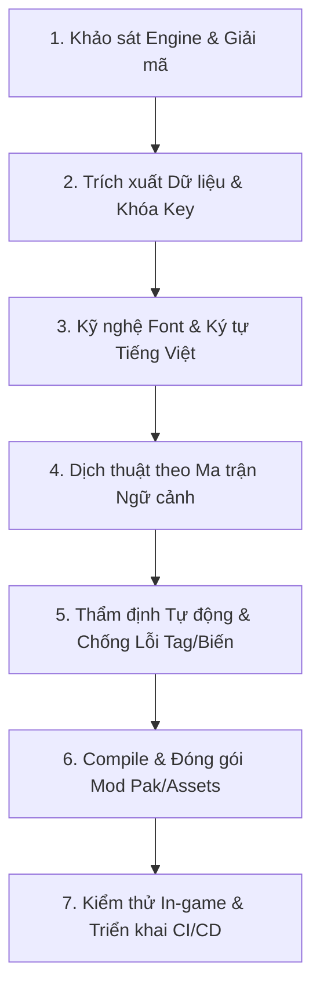

# Universal Game Localization & Translation Workflow (Master Guide)

Tài liệu này là **kim chỉ nam chuẩn mực quốc tế** quy định toàn bộ quy trình làm việc (Standard Operating Procedure - SOP) để AI Agent phân tích, trích xuất, xử lý font, dịch thuật, thẩm định và đóng gói bản dịch/Việt hóa cho bất kỳ tựa game nào.

---

## TỔNG QUAN QUY TRÌNH 7 BƯỚC (7-STEP END-TO-END WORKFLOW)



---

## BƯỚC 1: KHẢO SÁT ENGINE & GIẢI MÃ (ENGINE RECONNAISSANCE)

Trước khi can thiệp vào bất kỳ tệp tin nào, AI phải xác định chính xác Game Engine và cơ chế đóng gói:

| Game Engine | Dấu hiệu nhận diện | Vị trí lưu trữ ngôn ngữ thông thường | Công cụ xử lý khuyến nghị |
| :--- | :--- | :--- | :--- |
| **Unreal Engine** (UE4 / UE5) | Thư mục `Content/Paks`, các file `.pak`, `.ucas`, `.utoc` | `.locres`, `.locmeta`, DataTable (`DT_*.uasset`), StringTable | `repak`, `UAssetAPI`, `UnrealPak`, `FModel` |
| **Unity** | Thư mục `*_Data`, `StreamingAssets`, `sharedassets*.assets` | `I2Localization`, TextAsset, Addressables, Mono/IL2CPP | `UnityPy`, `AssetStudio`, `polib`, `UABEA` |
| **Godot** | File `.pck`, `project.godot` | File `.po`, `.translation`, `.csv` | `godot-pck-tool`, `polib` |
| **Custom / C++** | File `.zip`, `.dat`, `.bin`, `.db`, SQLite | `.json`, `.xml`, `.csv`, `.po`, `.mo`, SQLite DB | Python standard libraries, `sqlite3` |

### Quy tắc kiểm tra Mã hóa (Encryption check):
- Nếu Unreal Engine PAK yêu cầu mã hóa, trích xuất AES Key (256-bit) từ binary shipping (`*-Shipping.exe`) hoặc cộng đồng modding trước khi giải nén.
- Luôn sử dụng cơ chế nạp Mod không xâm lấn (Non-destructive patching): ưu tiên thư mục `~mods/`, file patch `_P.pak`, hoặc override trong `StreamingAssets/mods/`.

---

## BƯỚC 2: TRÍCH XUẤT DỮ LIỆU & BẢO TOÀN KHÓA ĐỊNH DANH (KEY EXTRACTION)

Dữ liệu trích xuất phục vụ dịch thuật **bắt buộc** phải tuân thủ định dạng có cấu trúc rõ ràng (JSON hoặc PO/CSV), tuyệt đối không xuất chuỗi trôi nổi không có Key:

```json
[
  {
    "key": "building_burgage_plot_lvl1",
    "en": "Burgage Plot (Level 1)",
    "vi": "Thửa đất Lãnh địa (Cấp 1)",
    "context": "Building Name",
    "offset": 24,
    "length": 23
  }
]
```

### Yêu cầu bắt buộc:
1. **Khóa định danh duy nhất (Unique Key/Msgctxt)**: Giữ nguyên FName, Key path hoặc sinh Semantic Key (`prefix_id`) để không nhầm lẫn giữa các ngữ cảnh.
2. **Metadata vị trí (Offset / Length / ID)**: Lưu lại thông tin byte/offset để khi biên dịch lại (re-serialize/patch) đạt tốc độ cao và độ chính xác 100%.
3. **Phân tách theo module**: Tách dữ liệu thành từng file JSON/PO riêng biệt theo từng hệ thống (Menus, UI, Items, Skills, Quests, Lore) để dễ dàng quản lý tiến độ và kiểm soát chất lượng.

---

## BƯỚC 3: KỸ NGHỆ FONT & BẢNG MÃ TIẾNG VIỆT (TYPOGRAPHY & FONT ENGINEERING)

Tiếng Việt sử dụng bảng ký tự Latin Extended-A với hệ thống dấu phức tạp (`ă, â, đ, ê, ô, ơ, ư` kết hợp 5 dấu thanh `sắc, huyền, hỏi, ngã, nặng`). Hiện tượng lỗi font phổ biến nhất là **ô vuông (Tofu)** hoặc **mất dấu**.

### Quy trình xử lý Font:
1. **Kiểm tra Font Atlas/SDF gốc của game**: Xác định font chính của UI có hỗ trợ Unicode Tiếng Việt hay không.
2. **Tích hợp Ký tự (Glyph Expansion)**:
   - Nếu game dùng TrueType/OpenType (`.ttf`, `.otf`, hoặc `.ufont` trong Unreal Engine): Bổ sung hoặc thay thế bằng các font tương đồng hỗ trợ đầy đủ tiếng Việt (ví dụ: Google Fonts: *Roboto*, *Saira*, *Lora*, *Merriweather*, *Noto Sans*).
   - **Kỹ thuật đóng gói Font trực tiếp vào Mod PAK (All-in-One Mod)**:
     - Trong Unreal Engine, các file `.ufont` thực chất là binary của tệp font TrueType (`.ttf`/`.otf`).
     - Khi đã chỉnh sửa thêm dấu tiếng Việt vào font (bằng *FontForge*, *Glyphs*, *FontLab*), chỉ cần đổi tên file font thành `FontName.ufont` và đóng gói chung vào file `.pak` cùng các asset font (`.uasset`/`.uexp`). Unreal Engine sẽ tự động nạp font Việt hóa từ file PAK, người chơi **không cần cài đặt font thủ công vào Windows**.
   - Nếu game dùng Bitmap / Signed Distance Field (SDF / TextMeshPro): Sử dụng công cụ generate lại font asset với bộ ký tự tiếng Việt đầy đủ (134 ký tự tiếng Việt có dấu).
3. **Fallback Font**: Đảm bảo game có font dự phòng (như `Arial Unicode MS`, `Noto Sans`) trong trường hợp một số ký tự đặc biệt không hiển thị được.

---

## ⚡ QUY TẮC BẮT BUỘC: SERIALIZE CHUỖI UNICODE UNREAL ENGINE (FSTRING RULES)

> [!CAUTION]
> **Lỗi hiển thị ký tự rác / Chữ Hàn Quốc (Encoding Corruption)**:
> Trong cơ chế serialization `FString` của **Unreal Engine (UE4 & UE5)**:
> - **Chuỗi ASCII (không dấu)**: Độ dài lưu dưới dạng **SỐ DƯƠNG** (`Length = charCount + 1`), theo sau bởi 1 byte/ký tự + 1 null byte `0x00`.
> - **Chuỗi Unicode (Tiếng Việt có dấu)**: Độ dài **BẮT BUỘC PHẢI LÀ SỐ ÂM** (`Length = -(charCount + 1)`), theo sau bởi dữ liệu **UTF-16 Little Endian (2 bytes/ký tự)** + 2 null bytes `0x00 0x00`.
>
> ❌ **Hậu quả nếu ghi sai**: Nếu ghi chuỗi tiếng Việt dưới dạng UTF-8 với độ dài dương, Unreal Engine sẽ hiểu nhầm là bảng mã 8-bit và zero-extend từng byte thành wchar, gây lỗi vỡ font nghiêm trọng (ví dụ: `Chơi mới` ➔ `Chㅓㄱi m £ ㅋㅁi`).
>
> ✅ **Code mẫu chuẩn (C# / Python)**:
> ```csharp
> bool isUnicode = viText.Any(c => c > 127);
> if (isUnicode) {
>     int charCount = viText.Length + 1;
>     int newLen = -charCount; // Số ÂM cho UTF-16 LE trong Unreal Engine!
>     byte[] textBytes = Encoding.Unicode.GetBytes(viText);
>     byte[] chunk = new byte[4 + charCount * 2];
>     BitConverter.GetBytes(newLen).CopyTo(chunk, 0);
>     textBytes.CopyTo(chunk, 4);
>     chunk[chunk.Length - 2] = 0; chunk[chunk.Length - 1] = 0;
> }
> ```

---

## BƯỚC 4: XÁC ĐỊNH PHONG CÁCH, TÔNG GIỌNG & ĐỀ XUẤT CHO USER (TONE OF VOICE & PROPOSAL)

> [!IMPORTANT]
> **Tôn chỉ quan trọng**: Không phải game nào cũng dịch theo kiểu hóm hỉnh, hài hước hay cợt nhả. Phong cách và văn phong bản dịch **bắt buộc phải thích ứng chính xác theo bối cảnh, thể loại và linh hồn của từng tựa game**. Trước khi dịch đại trà, AI phải phân tích thể loại game và **chủ động đề xuất bảng phong cách văn phong & xưng hô cho User duyệt/thống nhất**.

### 1. Ma trận Phong cách & Tông giọng theo Thể loại Game (Tone Archetypes):

| Thể loại / Chủ đề Game | Ví dụ tiêu biểu | Tông giọng & Văn phong (Tone of Voice) | Xưng hô & Thuật ngữ chủ đạo |
| :--- | :--- | :--- | :--- |
| **Lịch sử / Mô phỏng Trung Cổ** | *Manor Lords, Kingdom Come, Crusader Kings* | Nghiêm túc, chân thực, trang trọng, mang đậm chất phong kiến cổ xưa. | *Lãnh chúa, Nông nô, Dân quân, Lãnh địa, Điền trang, Triều đình*. Tuyệt đối không dùng từ lóng hiện đại. |
| **Dark Fantasy / Sinh tồn Khắc nghiệt** | *Against The Storm, Frostpunk, Dark Souls* | U tối, bi tráng, cấp bách, nghẹt thở, khắc họa cuộc chiến sinh tồn khốc liệt. | *Nguyện vọng của Nữ Vương, Bão Tố Cuồng Nộ, Đống Tro Tàn, Hiến Tế, Lửa Thánh*. |
| **Hài hước / Châm biếm / Hoạt họa** | *Oxygen Not Included, Don't Starve, Portal* | Hóm hỉnh, chơi chữ, tự trào, châm biếm sâu cay và giàu tính giải trí. | *Các Đệ (Duplicants), Bộ não in sinh học, Khí thoát phân giải*. |
| **Hậu tận thế / Công nghệ Sinh thái** | *Timberborn, Stray, Horizon* | Mộc mạc, đậm chất kỹ nghệ công trình, pha chút ngộ nghĩnh gần gũi với thiên nhiên. | *Thợ đập, Đội đốn gỗ, Đập tràn, Mùa hạn hán*. |
| **Mô phỏng Đấng Sáng Tạo / Thần thoại** | *WorldBox, Black & White, Godhood* | Quyền năng, bao quát, huyền thoại sử thi kết hợp tính chất ngẫu nhiên, tự do. | *Đấng Tạo Hóa, Thiên tai, Ban phước, Lời nguyền, Kỷ nguyên*. |
| **Khoa học Viễn tưởng / Hard Sci-Fi** | *Stellaris, Subnautica, Dead Space* | Chuẩn xác khoa học, thuật ngữ công nghệ cao, sắc lạnh hoặc huyền bí ngoài không gian. | *Động cơ bước nhảy, Vùng đứt gãy không-thời gian, Quét cảm biến*. |

### 2. Quy trình "Translation Pitch & Approval" sau khi xuất JSON (Bắt buộc):

Ngay sau khi xuất thành công dữ liệu JSON có đầy đủ Key (Bước 2), **AI KHÔNG ĐƯỢC tự ý dịch hàng loạt ngay**, mà phải thực hiện bước **Đề xuất Bản thiết kế Dịch thuật (Translation Pitch)** để User phê duyệt:

```
[Xuất xong JSON có Key] ──► [Tạo Translation Pitch & Bảng Thuật ngữ] ──► [User Review & Approve] ──► [Tiến hành Dịch theo đợt]
```

#### Nội dung bản Đề xuất (Translation Pitch) gửi cho User gồm 5 phần:
1. **Phân tích Bối cảnh & Tông giọng**: Xác định rõ linh hồn của game (Trang trọng/Lịch sử, U tối/Sinh tồn, Hài hước/Châm biếm, Khoa học...).
2. **Bảng Xưng hô & Ngôi thứ (Pronoun & Hierarchy Matrix)**:
   - Nhân vật chính / Người chơi được gọi là gì? (*Lãnh chúa, Ngài, Đấng Tạo Hóa, Chỉ huy, Bạn, Đệ*...).
   - Quan hệ giữa các NPC / Thần dân / Kẻ thù (*Nông nô xưng với Lãnh chúa, Tướng lĩnh xưng với Quân vương*...).
3. **Bảng Thuật ngữ Cốt lõi (Core Glossary - 15-20 thuật ngữ nền tảng)**:
   - Tiền tệ, tài nguyên, chỉ số cơ bản, tên công trình/đơn vị đặc thù.
4. **Mẫu dịch Thử nghiệm (Sample Translation - 5-10 dòng tiêu biểu)**:
   - 2 dòng Menu/UI, 2 dòng Tên & Mô tả Công trình, 2 dòng Lời thoại/Nhiệm vụ, 2 dòng Lore/Flavortext.
5. **Kế hoạch Phân kỳ Dịch theo Đợt (Phasing Plan)**:
   - Đợt 1: Core UI & Menus (để vào game nhìn thấy tiếng Việt ngay).
   - Đợt 2: Công trình, Nghề nghiệp, Vật phẩm.
   - Đợt 3: Quân sự, Ngoại giao, Kỹ năng, Sự kiện.
   - Đợt 4: Hướng dẫn (Tutorials) & Bách khoa (Wiki).

> 🛑 **ĐIỂM DỪNG (CHECKPOINT)**: AI xuất trình bản đề xuất và dừng lại đợi User duyệt hoặc yêu cầu tinh chỉnh thuật ngữ theo ý muốn. Chỉ khi User đồng thuận mới bắt đầu dịch Đợt 1.

---

### 3. Quy tắc dịch theo từng phân loại nội dung:

| Nhóm nội dung | Mục đích | Phong cách & Văn phong | Quy tắc kỹ thuật |
| :--- | :--- | :--- | :--- |
| **UI / HUD / Menu** | Nút bấm, chỉ số, cảnh báo | Ngắn gọn, dứt khoát, súc tích (1-3 từ). Tránh giải thích dài dòng gây vỡ giao diện. | **Độ dài không vượt quá 1.8x** so với chuỗi gốc tiếng Anh. |
| **Công trình / Trang bị / Kỹ năng** | Tên thiết bị, vũ khí, hiệu ứng | Chuẩn xác theo logic kỹ thuật hoặc thời kỳ lịch sử của game. | Giữ nguyên danh từ chuyên môn, không đưa công dụng vào tên gọi. |
| **Cốt truyện / Hội thoại / Nhiệm vụ** | Lời thoại nhân vật, cắt cảnh | Bám sát tính cách nhân vật, giàu cảm xúc, đúng xưng hô đã thống nhất. | Giữ nguyên dấu ngắt câu, nhịp điệu và các đại từ xưng hô theo thiết lập thế giới. |
| **Lore / Flavortext / Bách khoa** | Sách tra cứu, mô tả đồ vật | Giữ trọn vẹn văn phong tác giả (nghiêm trang nếu là lịch sử, châm biếm nếu là hài hước). | Dịch thoát nghĩa nhưng bảo đảm truyền tải đủ thông điệp gốc. |

---

## BƯỚC 5: RÀNG BUỘC KỸ THUẬT & QUY TRÌNH THẨM ĐỊNH TỰ ĐỘNG (VERIFICATION LOOP)

Trước khi đóng gói bất kỳ bản dịch nào, AI **BẮT BUỘC** phải chạy script thẩm định tự động (`verify_translation.py`).

### 6 Quy tắc bất biến (Technical Invariants):
1. **Bảo toàn Placeholder tuyệt đối**: Không được dịch hoặc làm thay đổi tên biến: `{0}`, `{1}`, `{Amount}`, `{PlayerName}`, `{br}`, `{Hotkey}`.
2. **Bảo toàn Thẻ định dạng (RichText & Links)**:
   - Các thẻ mở và đóng phải khớp số lượng: `<b>`, `</b>`, `<i>`, `</i>`, `<color=...>`, `</color>`.
   - Các thẻ Unreal/Unity đặc thù: `<h>...</>`, ``, `<link="ID">...</link>`, `<style="ID">`.
3. **Ký tự xuống dòng (`\n`) & Escape Sequences**: Số lượng `\n`, `\r\n`, `\t`, `\\"` trong bản dịch phải khớp chính xác với bản gốc.
4. **Không dịch Thương hiệu & Tên riêng Hệ thống**: Giữ nguyên `Steam`, `Discord`, `DirectX`, `OpenGL`, `Vulkan`, `Klei`, `Epic Games`, `Xbox`.
5. **Chống tràn UI (UI Length Guard)**: Tự động cảnh báo khi chuỗi dịch trong menu/giao diện dài vượt mức an toàn (`> 1.8x` độ dài gốc).
6. **Kiểm tra tiến độ & Tính toàn vẹn JSON/PO**: Đảm bảo không bị lỗi cú pháp parse (JSON Syntax Error / PO format error), theo dõi chính xác tỉ lệ `% hoàn thành`.

---

## BƯỚC 6: BIÊN DỊCH & ĐÓNG GÓI MOD (COMPILATION & PACKAGING)

1. **Re-serialize / Binary Patching**:
   - Chuyển đổi JSON/PO đã dịch và thẩm định ngược lại định dạng file của game (`.uasset/.uexp`, `.mo`, `.assets`, `.locres`).
   - Tự động cập nhật `SerialSize`, `Header Offsets`, `String Table lengths`.
2. **Tự động Đóng gói (Pak Packaging)**:
   - Đóng gói tài nguyên đã build thành tệp tin Mod hoàn chỉnh (`pakchunk99-Vietnamese_P.pak`, `VietnameseMod.zip`).
   - Gắn cờ Mount Point chính xác (ví dụ: UE: `../../../GameName/Content/`).
3. **Cơ chế Hot-deploy**:
   - Viết sẵn script `build_and_deploy_mod.py` để copy trực tiếp bản build vào thư mục mod của game trên máy tính người dùng (`Content/Paks/~mods/` hoặc `StreamingAssets/mods/`), cho phép test ngay lập tức chỉ với một câu lệnh.

---

## BƯỚC 7: KIỂM THỬ THỰC TẾ & TÍCH HỢP CI/CD (IN-GAME QA & AUTOMATION)

1. **Checklist Kiểm thử trong game (In-Game QA Checklist)**:
   - [ ] Màn hình chính & Cài đặt hiển thị tiếng Việt chuẩn, không lỗi font / ô vuông.
   - [ ] Giao diện HUD, thanh tài nguyên, popup thông báo không bị tràn khung hoặc cắt chữ.
   - [ ] Màn hình tạo nhân vật / chọn bản đồ hiển thị đủ mô tả.
   - [ ] Các đoạn hội thoại dài và hướng dẫn chơi (Tutorials) hiển thị đúng format, xuống dòng mượt mà.
   - [ ] Lưu game (Save) và Tải game (Load) hoạt động bình thường, không gây crash engine.
2. **Tích hợp GitHub Actions CI/CD**:
   - Tự động build Mod ZIP khi có commit mới.
   - Tự động chạy verify script trong pipeline trước khi tạo GitHub Release.
   - Tự động tăng version tag (`v1.0.0`, `v1.0.1`) theo chuẩn SemVer.
