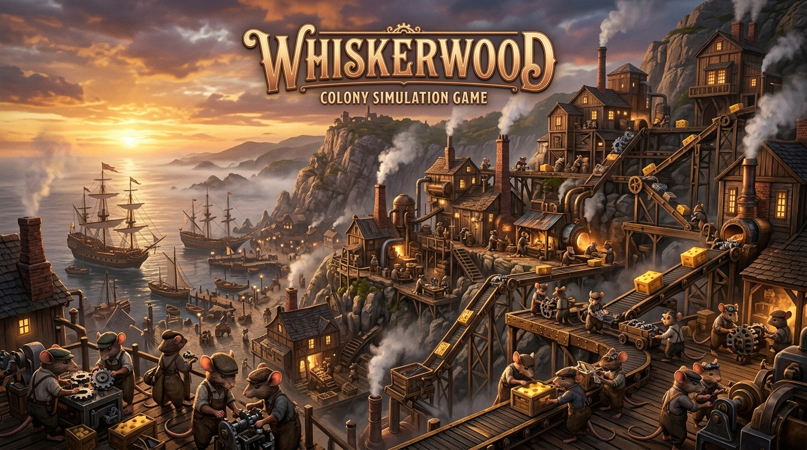

# 🐭 Whiskerwood - Bản Dịch Tiếng Việt (Vietnamese Localization)

<div align="center">



[](https://github.com/Nam088/mod-game/tree/master/Whiskerwood)
[-blue?style=for-the-badge&logo=steam)](https://github.com/Nam088/mod-game)
[](https://www.unrealengine.com)
[](https://github.com/Nam088/mod-game/releases)
[](https://github.com/Nam088/mod-game)

**Bản mod Việt hóa hoàn thiện 100% cho tựa game sinh tồn, xây dựng thuộc địa và quản lý chuỗi cung ứng cơ khí thời Victoria - Whiskerwood.**

[Tải Về Bản Mod (ZIP)](Whiskerwood-Vietnamese-Mod-v0.1.0.zip) • [Xem Trang Giới Thiệu Web](https://nam088.github.io/mod-game/) • [Báo Lỗi & Góp Ý](https://github.com/Nam088/mod-game/issues)

</div>

---

## 📖 1. Giới Thiệu Tựa Game

**Whiskerwood** là tựa game mô phỏng xây dựng thành phố, sinh tồn và quản lý chuỗi cung ứng logistics cơ khí hơi nước thế giới mở. 

Người chơi vào vai **Trưởng Làng (Tail / Acting Tail)**, dẫn dắt bầy chuột tha hương vượt đại dương đến khai hoang các hòn đảo hoang sơ. Bạn sẽ phải:
- Thiết lập hệ thống băng tải, máng trượt, phễu nạp, thang nâng thẳng đứng và bệ phóng để tự động hóa dây chuyền sản xuất trên địa hình đồi núi dốc đứng.
- Xây dựng mạng lưới lò sưởi hơi nước, dự trữ than củi và lương thực để giúp bầy chuột vượt qua Mùa Băng Giá khắc nghiệt.
- Đối mặt với ách cai trị bóc lột của **Hoàng Gia Mèo (Phe Móng Vuốt / The Claws)** dưới sự chỉ đạo của Khâm Sai - Công Tước Micalico, liên tục đòi cống nạp và siết nợ thuế.
- Điều động tàu thuyền đánh cá, thám hiểm biển sâu, đối phó hiểm họa Hải Tặc và thắp lên ngọn lửa **Cuộc Khởi Nghĩa Của Loài Chuột**.

---

## ✨ 2. Đặc Sắc Bản Việt Hóa

- **100% Nội dung trong game (2,751 chuỗi)**: Bao gồm toàn bộ Menu, Giao diện (HUD), Cài đặt phím, Công trình, Logistics, Tài nguyên chế tạo, Tâm lý & Nhu cầu bầy chuột, Thám hiểm hàng hải, và trọn vẹn Tuyến nhiệm vụ cốt truyện Hồi I & Hồi II.
- **Tiêu chuẩn QA Tier S (9.1/10)**: Đã trải qua 3 Phase dịch thuật cùng nhiều đợt kiểm định độc lập (Blind QA Specialist, Lead QA, Random Audit 75 chuỗi) đảm bảo:
  - 0% lỗi lệch tham số placeholder (`<0>`, `{0}`).
  - Giữ nguyên vẹn 100% thẻ RichText, màu sắc (`<highlight>`, `<cat>`), thẻ xuống dòng (`\n`).
  - Kiểm soát nghiêm ngặt độ dài chuỗi (UI Length Guard), chống vỡ/tràn khung giao diện.
- **Tuân thủ chuẩn ngữ cảnh sinh thái loài vật (Mouse Ecology Lore)**:
  - Tuyệt đối không dùng từ ngữ loài người ("người dân", "người làm", "lòng người").
  - Chuẩn hóa sang từ vựng loài chuột thuần Việt: *cư dân chuột, chú chuột, chuột thợ, đồng loại, bầy chuột, lòng dân bầy chuột, tâm tư*.
  - Sắc thái văn phong phân hóa rõ rệt: Giọng điệu Công Tước Mèo trịch thượng bề trên; Giọng bầy chuột lam lũ, đùm bọc, tha thiết; Giọng Hải Tặc bặm trợn sòng phẳng; Giọng chàng thủy thủ Stormie kiêu hùng, ngang tàng khao khát tự do.
- **Hệ thống Font chữ BE VIETNAM PRO chuẩn hóa 100% cực kỳ sắc nét & êm mắt**: 
  - Khắc phục triệt để mọi lỗi ô vuông bằng họ font **Be Vietnam Pro** (Geometric Sans-Serif chuẩn quốc tế được thiết kế chuyên biệt cho tiếng Việt):
    - **Toàn bộ Giao diện, Menu, HUD, Nút bấm & Bảng cơ khí**: Chuẩn hóa Be Vietnam Pro (đầy đủ các biến thể Regular, Medium, SemiBold, Bold, ExtraBold, Italic) với tỉ lệ hình học 1:1 tương đương font gốc Poppins, hiển thị sắc nét từng con số và ký hiệu.
    - **Toàn bộ Sách, Tiêu đề, Sắc lệnh hoàng gia & Thư từ**: Chuẩn hóa Be Vietnam Pro Regular & Bold với khoảng cách dấu thanh điệu thoáng đãng, êm mắt, đọc cực kỳ dễ chịu và thanh thoát.

---

## 📦 3. Cấu Trúc Bản Dịch

Dữ liệu Việt hóa được phân tách khoa học thành 6 phân hệ JSON chuyên biệt:

| Phân hệ | Tệp dữ liệu | Số lượng chuỗi | Nội dung chi tiết |
| :--- | :--- | :---: | :--- |
| **01. Giao diện & Menu** | [`01_Core_UI_Menus.json`](translations/01_Core_UI_Menus.json) | 391 | Main menu, HUD, phím tắt, cài đặt đồ họa/âm thanh, thống kê dân số |
| **02. Công trình & Logistics** | [`02_Buildings_Logistics.json`](translations/02_Buildings_Logistics.json) | 409 | Băng chuyền, máng trượt, phễu nạp, thang nâng, lò sưởi, xưởng thợ, nhà ở |
| **03. Tài nguyên & Công nghệ** | [`03_Resources_Items_Tech.json`](translations/03_Resources_Items_Tech.json) | 350 | Nông sản, quặng kim loại, vải vóc, trà, than củi, cây công nghệ, chính sách |
| **04. Tâm tư & Tính cách chuột** | [`04_Mice_Traits_Thoughts.json`](translations/04_Mice_Traits_Thoughts.json) | 250 | Đặc tính di truyền, cảm xúc thường nhật (moodlets), nhu cầu đời sống, đào tạo |
| **05. Hàng hải & Thế giới** | [`05_Nautical_Exploration_World.json`](translations/05_Nautical_Exploration_World.json) | 339 | Tàu thuyền, hải trình, thời tiết bão tuyết, chạm trán hải chiến, tên đảo ngẫu nhiên |
| **06. Nhiệm vụ & Cốt truyện** | [`06_Quests_Events_Story.json`](translations/06_Quests_Events_Story.json) | 1,012 | Thư từ Công Tước Micalico, yêu sách Mèo, nhiệm vụ Hồi I & II, khởi nghĩa Stormie |
| **TỔNG CỘNG** | **6 tệp JSON** | **2,751 keys** | **Hoàn thiện 100% - Đạt chuẩn Tier S** |

---

## 🗂️ 4. Bảng Thuật Ngữ Cốt Lõi (Core Glossary)

| Thuật ngữ gốc (EN) | Bản dịch tiếng Việt | Phân loại | Ghi chú ngữ cảnh |
| :--- | :--- | :--- | :--- |
| **The Claws** | **Phe Móng Vuốt** | Phe phái | Triều đình loài mèo cai trị và bóc lột |
| **Whiskers** | **Bầy Chuột / Loài Chuột** | Chủng loài | Cư dân bầy chuột lao động lam lũ |
| **Tail / Acting Tail** | **Trưởng Làng / Quyền Trưởng Làng** | Danh xưng | Chức vụ người chơi lãnh đạo thuộc địa |
| **Approval** | **Lòng Dân** | Chỉ số | Chỉ số hài lòng của bầy chuột thuộc địa |
| **Whisker Conveyor** | **Băng Chuyền Chở Chuột** | Logistics | Hệ thống băng tải vận chuyển bầy chuột di chuyển nhanh |
| **Input Hopper / Output Hopper** | **Phễu Nạp Hàng / Phễu Nhả Hàng** | Cơ khí | Cơ cấu nạp/nhả hàng tự động của băng chuyền |
| **Jump Pad** | **Bệ Bắn Hàng / Bệ Phóng Chuột** | Cơ khí | Đệm lò xo cơ khí bắn hàng hóa và chuột qua vực dốc |
| **Vertical Chute** | **Máng Trượt Thẳng Đứng** | Logistics | Máng thả hàng hóa thẳng đứng lợi dụng trọng lực |
| **Charcoal Furnace** | **Lò Than Củi** | Công trình | Sản xuất than củi cấp nhiên liệu lò sưởi |
| **Steam Boiler** | **Nồi Hơi Nước** | Công trình | Cung cấp nhiệt sưởi ấm qua mùa đông |
| **Fine Tea** | **Trà Thượng Hạng** | Tài nguyên | Nhu yếu phẩm cao cấp và cống phẩm cho loài Mèo |
| **Ballast Rocks** | **Đá Dằn Tàu** | Tài nguyên | Khối đá nặng giữ thăng bằng tàu khi vượt biển |

---

## 🚀 5. Hướng Dẫn Cài Đặt (Chỉ 2 Bước)

### Cách 1: Cài đặt bản đóng gói sẵn (Khuyến nghị cho game thủ)
1. Tải tệp [**`Whiskerwood-Vietnamese-Mod-v0.1.0.zip`**](Whiskerwood-Vietnamese-Mod-v0.1.0.zip) (dung lượng ~1.9 MB).
2. Mở thư mục cài đặt game trên máy tính của bạn:
   - **Đường dẫn mặc định**: `[Thư Mục Cài Game]\Whiskerwood\Content\Paks\`
3. Tạo thư mục con có tên `~mods` nếu chưa có (kết quả: `Whiskerwood\Content\Paks\~mods\`).
4. Giải nén tệp `Whiskerwood-Vietnamese_P.pak` vào thư mục `~mods` nói trên.
5. Khởi động game Whiskerwood và tận hưởng 100% tiếng Việt mượt mà!

*(Để gỡ mod: Chỉ cần xóa file `Whiskerwood-Vietnamese_P.pak` khỏi thư mục `~mods`).*

---

## 🛠️ 6. Quy Trình Kỹ Thuật (Pipeline Dành Cho Dev)

Dự án sử dụng bộ công cụ tùy biến cao để can thiệp trực tiếp vào dữ liệu Unreal Engine 5:

```text
translations/*.json 
    ├── [verify_translation.py] ➔ Kiểm tra cú pháp, biến số & UI fit
    ├── [uasset_patcher.py]     ➔ Patch chuỗi Unicode FString vào Loc_En.uasset / Loc_En.uexp
    └── [repak.exe]             ➔ Đóng gói PAK chunk ➔ Whiskerwood-Vietnamese_P.pak
```

### Lệnh thực thi nhanh:
- **Kiểm tra cú pháp toàn bộ tệp dịch**:
  ```powershell
  python tools/verify_translation.py
  ```
- **Tự động Build file PAK và nạp thẳng vào game**:
  ```powershell
  python build_and_deploy_mod.py
  ```

---

## 👥 Đóng Góp & Tác Quyền

- **Dự án**: Kho Mod Tiếng Việt Cho Game PC (`mod-game`)
- **Tác giả**: [Nam088](https://github.com/Nam088)
- **Giấy phép**: Bản mod được phát hành phi thương mại nhằm phục vụ cộng đồng game thủ Việt Nam. Mọi quyền sở hữu trí tuệ đối với game gốc thuộc về nhà phát triển và phát hành Whiskerwood.
